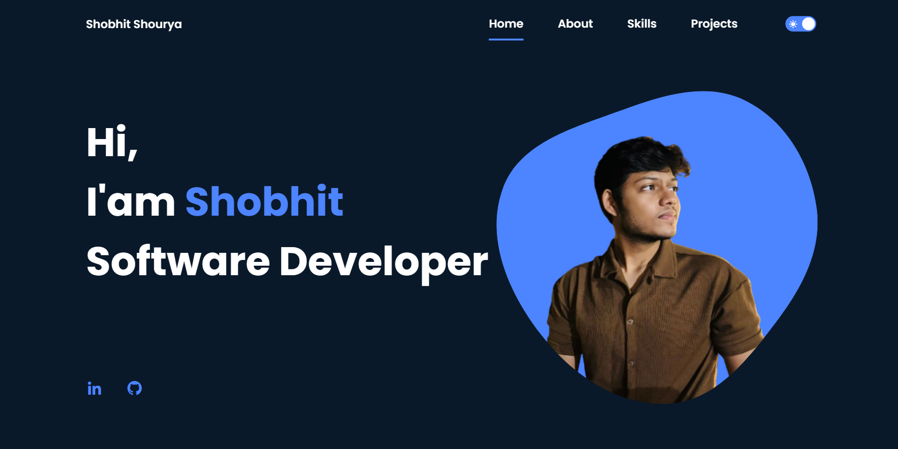

# Personal Portfolio Website



A modern, responsive portfolio website showcasing my skills, projects, and professional experience. Built with HTML, CSS, and JavaScript, featuring both light and dark modes.

## 🌟 Features

- **Responsive Design**: Works seamlessly on desktop, tablet, and mobile devices
- **Dark/Light Mode**: Toggle between dark and light themes with state persistence
- **Smooth Scrolling**: Enhanced navigation with smooth scroll behavior
- **Modern UI**: Clean and professional interface with:
  - Glassmorphism effects
  - Hover animations
  - Dynamic project cards
  - Skill icons display
  - Animated sections

## 🛠️ Technologies Used

- HTML5
- CSS3
- JavaScript
- [BoxIcons](https://boxicons.com/) for icons
- [ScrollReveal](https://scrollrevealjs.org/) for scroll animations

## 📱 Sections

1. **Home**: Introduction and social links
2. **About**: Brief bio with animated coding illustration
3. **Skills**: Technical skills with categorized icons
   - Programming Languages
   - Web Technologies
   - Libraries & Frameworks
   - CI/CD, Cloud, & Databases
   - Design & Other Tools
4. **Projects**: Showcase of key projects including:
   - Brain Dump to Code (VS Code Extension)
   - AutismScope (ML Application)
   - Stock Price Predictor
   - Scribl (Note-taking App)
   - CleanIT (Scheduling Application)
   - Password Generator

## 🚀 Getting Started

1. Clone the repository:
   ```bash
   git clone https://github.com/yourusername/portfolio.git
   ```

2. Open `index.html` in your browser:
   - You can use Live Server in VS Code
   - Or open the file directly in your browser

3. To modify:
   - Edit `index.html` for content changes
   - Modify `styles.css` for styling
   - Update `main.js` for JavaScript functionality

## 🎨 Customization

### Colors
The color scheme can be modified in the `:root` section of `styles.css`:
```css
:root {
  --hue-color: 224;
  --first-color: hsl(var(--hue-color), 89%, 60%);
  --second-color: hsl(var(--hue-color), 56%, 12%);
}
```

### Dark Theme
Dark theme colors can be adjusted in the `.dark-theme` class:
```css
.dark-theme {
  --body-bg: #0a1929;
  --container-bg: #132f4c;
  --text-color: #fff;
}
```

## 📱 Responsive Design

The website is responsive across multiple breakpoints:
- Mobile: 320px and up
- Tablet: 576px and up
- Desktop: 768px and up
- Large Desktop: 992px and up

## 🔧 Project Structure

```
portfolio/
│
├── index.html              # Main HTML file
├── styles.css             # Main CSS file
├── assets/
│   ├── js/
│   │   └── main.js       # JavaScript functionality
│   └── img/              # Images and icons
└── README.md             # Project documentation
```

## 🤝 Contributing

Feel free to fork this project and customize it for your own use. If you have any improvements or bug fixes:

1. Fork the project
2. Create your feature branch (`git checkout -b feature/AmazingFeature`)
3. Commit your changes (`git commit -m 'Add some AmazingFeature'`)
4. Push to the branch (`git push origin feature/AmazingFeature`)
5. Open a Pull Request

## 📄 License

This project is open source and available under the [MIT License](LICENSE).
